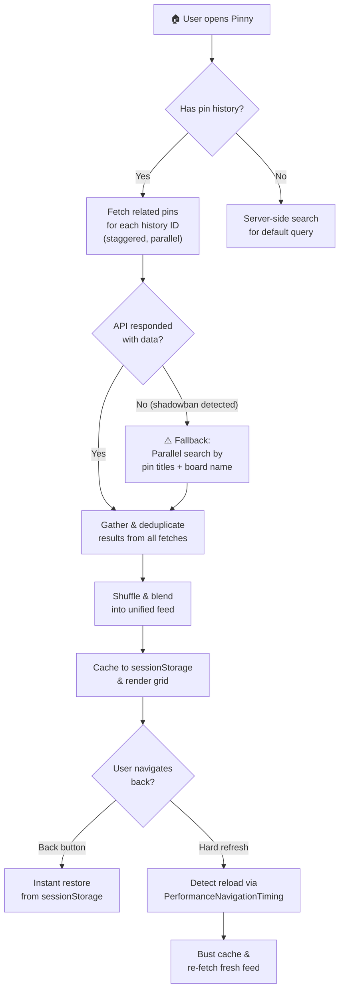

# Pinny

Pinny is a beautiful, open-source, **private frontend for Pinterest**. Built with **Next.js 16**, it is designed to showcase advanced front-end architecture, API proxying, and performance optimization.

It provides an infinitely scrolling, perfectly virtualized masonry grid, robust recommendation blending, and a completely private local-board saving system.

## 🌟 Key Features

- **Next.js 16 App Router**: Leverages the latest React paradigms and Turbopack for lightning-fast builds.
- **Masonry UI Virtualization**: Implements a highly optimized, infinitely scrolling grid that dynamically measures and batches images to prevent DOM bloat.
- **Complex Recommendation Engine**: Seamlessly blends multiple history interests into a unified, privacy-friendly home feed.
- **Progressive Web App (PWA)**: Fully installable on iOS and Android devices with a native app feel and offline fallback capabilities.
- **100% Private Local Boards**: Uses `IndexedDB` to securely save and categorize your favorite pins locally on your device. Your boards are never uploaded to a cloud server.
- **Intelligent Cache Persistence**: Features zero-second scroll restoration when using the back button by intelligently manipulating `sessionStorage` and browser `beforeunload` events.

> **Note:** When using a public instance on [pinnyapp.vercel.app](https://pinnyapp.vercel.app) your address is proxied through our servers, however if you host the stack locally, your IP can be exposed to Pinterest servers.

## 🛠️ Tech Stack

- **Framework**: Next.js 16 (App Router)
- **Styling**: Vanilla CSS for maximum performance and fluid dynamic layouts
- **Storage**: IndexedDB (for Boards) & Session Storage (for caching)
- **Backend APIs**: Next.js Serverless API Routes (CORS proxying)

## ⚙️ How It Works — Data Pipeline & Fallbacks

Pinny doesn't just hit a single API endpoint and call it a day. It runs a multi-stage data pipeline with automatic failure recovery, designed to always deliver a feed — even when Pinterest actively blocks requests.

### 📡 Primary Source — Related Pins API

When a user has browsing history (stored in the `pinny_history` cookie), the app fires parallel requests to Pinterest's **related pins endpoint** for each saved pin ID. Requests are staggered with random delays (up to 2.5s) to avoid rate-limiting. If a board name is available, an additional search query using the board name is blended in to improve thematic relevance.

### 🛡️ Shadowban Detection

Pinterest aggressively blocks automated access. Pinny detects this in real-time: if any related-pins response returns empty data or a non-200 status, the app immediately flags a shadowban and halts all remaining related-pins fetches. A 15-second timeout acts as a safety net for stalled requests.

### 🔄 Fallback Pipeline

When a shadowban is detected, Pinny seamlessly switches to a **parallel search-based strategy**. It takes the titles of your saved pins (and the current board name, if applicable) and fires concurrent text searches against Pinterest's search API. The user sees no error — just a brief loading state before the feed appears with contextually relevant results.

### 🔀 Feed Blending

Results from multiple sources (related pins, search fallbacks, board-name queries) are gathered into a single pool, then **Fisher-Yates shuffled** to create a natural, non-repetitive feed. Duplicate pin IDs are stripped out before rendering.

### 💾 Caching Strategy

Pinny uses `sessionStorage` to preserve the complete feed state — images, scroll position, bookmarks, and query context. When you hit the browser's **back button**, the feed restores instantly with zero re-fetching. However, if you **hard-refresh** (F5 / pull-to-refresh), the app detects this via the `PerformanceNavigationTiming` API and busts the cache, fetching an entirely fresh feed.

## 🔒 Privacy & Networking Architecture

Here is a breakdown of exactly how the networking behaves in different deployment scenarios:

**When users access a public Vercel instance:**
- The user's browser sends a request to the Vercel deployment.
- Vercel's backend servers execute the application's API logic (such as fetching pins or proxying images) by making direct, server-to-server requests to Pinterest.
- Because Vercel's infrastructure acts as the middleman, Pinterest only ever sees the IP address of the Vercel server making the request. This completely hides the end user's personal IP address.

**When you host the stack locally (e.g., running `npm run dev` or `npm run start`):**
- Your browser sends a request to your local Next.js server running on localhost.
- Your local Node.js server executes the API logic and makes the requests to Pinterest.
- Because the "server" making the request is physically running on your own computer, the IP address exposed to Pinterest is your home network's public IP address.

## ⚖️ License & Disclaimers

### GNU General Public License v3.0
This project utilizes backend proxying concepts and data structures heavily inspired by [Binternet](https://github.com/Ahwxorg/Binternet), which is licensed under the **GNU General Public License v3.0**. In compliance with the GPLv3 copyleft terms, Pinny is also released under the GNU General Public License v3.0.

### Disclaimer
> **Disclaimer:** This is a non-commercial, educational portfolio project. It is not affiliated with, endorsed by, or connected to Pinterest. It was built strictly to demonstrate advanced full-stack engineering, API proxying, and UI virtualization.
> 
> Pinny does not host any content. All content shown on this application is sourced from Pinterest™. Pinterest is a registered trademark of Pinterest Inc. Pinny is not affiliated with Pinterest Inc. Any issues with content shown on any Pinny instances need to be reported to Pinterest, not the instance host's internet provider or domain provider.
